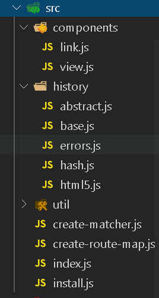

# Vue-Router

## 演示基本效果

## Vue-Router 源码结构

 

### Vue.use() 注册插件源码

- src\core\global-api\use.js

```js
export function initUse (Vue: GlobalAPI) {
    // Vue.use(VueRouter, options)
    Vue.use = function (plugin: Function | Object) {
        const installedPlugins = (this._installedPlugins || (this._installedPlugins = []))    
        // 防止重复注册
        if (installedPlugins.indexOf(plugin) > -1) {
		   // return this 为了链式调用
            return this
        }

        // additional parameters
        // 把数组中的第一个元素(plugin)去除，a'r
        const args = toArray(arguments, 1)
        // 把this(Vue)插入第一个元素的位置
        args.unshift(this)
        //  args --> [Vue, options]
        if (typeof plugin.install === 'function') {
            // plugin.install(...args)
            plugin.install.apply(plugin, args)  // plugin.install(args[0], args[1])
        } else if (typeof plugin === 'function') {
            plugin.apply(null, args)
        }
        installedPlugins.push(plugin)
        return this
    }
}
```

## 模拟整体结构

### VueRouter 基本结构

```js
export default class VueRouter {
  constructor (options) {
    // 记录所有的路由规则
    this._routes = options.routes || []
  }
  
  init () {}
}
```

### install 方法

- 注册 VueRouter 插件，并给 Vue 根实例，以及每一个子组件对象设置 _routerRoot ，让子组件可以获取到根实例，以及根实例中存储的 _router 对象

```js
export let _Vue = null
export default function install (Vue) {
  _Vue = Vue
  _Vue.mixin({
    beforeCreate () {
      // 判断当前是否是 Vue 的根实例
      if (this.$options.router) {
        this._router = this.$options.router
        // 根实例记录自己，目的是在子组件中通过 _routerRoot 获取到 _router 对象
        this._routerRoot = this
        this._router.init(this)
      } else {
        // 给子组件设置 routerRoot，让子组件能够通过 routerRoot 找到 _router 对象
        this._routerRoot = this.$parent && this.$parent._routerRoot
      }
    }
  })
}
```

- 挂载 install

```js
import install from './intall'
export default class VueRouter {
  constructor (options) {
    // 记录所有的路由规则
    this._routes = options.routes || []
  }

  // 初始化事件监听器，监听路由地址的变化
  // 改变 url 中的路由地址
  init (app) {
  }
}
VueRouter.install = install
```


### router-link、router-view

- 此时创建这两个组件的目的是为了测试
- router-link

```js
export default {
  props: {
    to: {
      type: String,
      required: true
    }
  },
  // template: `<a :href="'#' + this.to"><slot name="default"></slot></a>`
  render (h) {
    return h('a', { attrs: { href: '#' + this.to } }, [this.$slots.default])
  }
}
```

- router-view

```js
export default {
  render (h) {
    return h()
  }
}
```

### createMatcher  和  createRouteMap

#### createMatcher

- 创建并返回一个匹配器，包含 match 方法和 addRoutes 方法
  - match 根据路由地址匹配相应的**路由规则**对象
  - addRoutes 动态添加路由
- 把所有的路由规则解析成路由表
  - pathList 是一个数组，存储所有的路由地址
  - pathMap 路由表，路由地址 -> record 一个记录（path、component、parent）

```js
export default function createMatcher (routes) {
  // routes 所有的路由规则
  // 把路由规则解析成数组和对象的形式存储到 pathList pathMap
  const { pathList, pathMap } = createRouteMap(routes)

  function match (path) {

  }
  function addRoutes (routes) {
		createRouteMap(routes, pathList, pathMap)
  }
  return {
    match,
    addRoutes
  }
}
```

#### createRouteMap

- 遍历所有的路由规则，生成路由表
- 如果有子路由的话，递归添加子路由到路由表

```js
export default function createRouteMap (routes, oldPathList, oldPathMap) {
  const pathList = oldPathList || []
  const pathMap = oldPathMap || {}
  // 遍历路由规则，解析成路由表
  routes.forEach(route => {
    addRouteRecord(route, pathList, pathMap)
  })
  return {
    pathList,
    pathMap
  }
}
// 添加路由表
function addRouteRecord (route, pathList, pathMap, parent) {
  const path = parent ? `${parent.path}/${route.path}` : route.path
  const record = {
    path: path,
    component: route.component,
    parent // 如果是子路由的话，记录子路由的 parent record
  }

  // 如果路由表中有已经有该路径，不做处理
  if (!pathMap[path]) {
    pathMap[path] = record
    pathList.push(path)
  }
  // 如果有子路由，递归添加到对应的 pathList 和 pathMap 中
  if (route.children) {
    route.children.forEach(childRoute => {
      addRouteRecord(childRoute, pathList, pathMap, record)
    })
  }
}
```

#### createMatcher -- match

- 根据路由地址，匹配一个**路由数据对象 route** { matched, path }
  - create-matcher.js 中

```js
function match (path) {
  const record = pathMap[path]
  if (record) {
    return createRoute(record, path)
  }
  return createRoute(null, path)
}
```

- createRoute 根据路由地址，创建 route 路由规则对象
  - route --> { matched: [ musicRecord ], path: '/music' }
  - 如果是子路由的话，找到他的所有父路由对应的 record 插入到数组的第一项中
  - matched 数组中 -> [musicRecord, popRecord]

```js
function createRoute (record, path) {
  const matched = []
  while (record) {
    matched.unshift(record)
    record = record.parent
  }
  return {
    matched,
    path
  }
}
```

- VueRouter 的构造函数中

```js
// createMatcher 返回 match 匹配的方法 和 addRoutes 动态添加路由的方法
this.matcher = createMatcher(routes)
```


### History 历史管理

- hash 模式
- html 5 模式

- History 父类
  - router 属性
  - current 属性，记录当前路径对应的**路由规则对象** {path:'/', matched: []}
  - transitionTo(path, onComplete)
    - 跳转到指定的路径，根据当前路径获取匹配的路由规则对象 route，然后更新视图

```js
export default class History {
  constructor (router) {
    this.router = router
    // 当前路径获取到的匹配的结果
    //  { path:'/', matched: [] }
    this.current = createRoute(null, '/')
  }
  transitionTo (path, onComplete) {
    // 根据路径获取匹配到的路由规则对象，渲染页面
    // { path: '/music/pop', matched: [musicRecord, popRecord] }
    this.current = this.router.matcher.match(path)
    console.log(path, this.current)
    onComplete && onComplete()
  }
}
```

- HashHistory
  - 继承 History
  - 确保首次访问地址为 #/
  - getCurrentLocation() 获取当前的路由地址（# 后面的部分）
  - setUpListener()  监听路由地址改变的事件

```js
import History from './base'
export default class HashHistory extends History {
  constructor (router) {
    super(router)
    // 如果是第一次访问设置为首页 #/
    ensureSlash()
  }
  getCurrentLocation () {
    return window.location.hash.slice(1)
  }
  setUpListener () {
    window.addEventListener('hashchange', () => {
      this.transitionTo(this.getCurrentLocation())
    })
  }
}
function ensureSlash () {
  // 判断#后面有内容
  if (window.location.hash) {
    return
  }
  window.location.hash = '/'
}
```

- VueRouter 构造函数中初始化 history
  - 根据创建 VueRouter 传来的 mode 决定使用哪个 History 对象

```js
const mode = this.mode = options.mode || 'hash'
switch (mode) {
  case 'hash':
    this.history = new HashHistory(this)
    break
  case 'history':
    this.history = new HTML5History(this)
    break
  default:
    throw new Error('mode error')
}
```


- VueRouter 的 init 中调用

```js
// 初始化事件监听器，监听路由地址的变化
// 改变 url 中的路由地址
init (app) {
  const history = this.history
  const setUpListener = _ => {
    history.setUpListener()
  }
  history.transitionTo(
    history.getCurrentLocation(),
    setUpListener
  )
}

// install 中调用 init()
```

### 给 router 对象设置响应式的 _route 属性

- 参考源码，在 install.js 中

```js
Vue.util.defineReactive(this, '_route', this._router.history.current)
```

- 让 _route 改变
- 在 history/base.js 中

```js
// 增加属性
this.cb = null

// 增加一个 listen 方法
// 在 transitionTo 中调用，触发回调，给 _route 赋值
listen (cb) {
  this.cb = cb
}

// transitionTo 方法中
transitionTo (path, onComplete) {
  this.current = this.router.matcher.match(path)
  
	// 调用 listen 中设置的回调，并且把 最新的 current 传递给 cb
  // cb 中把当前的 current 赋值给 app._route 响应式数据发生变化，更新视图
  this.cb && this.cb(this.current)
  
  onComplete && onComplete()
}

```

- VueRouter 中
  - index.js

``` js
init () {
  …………
  // init 的最后调用 父类中的 listen 方法
  // 在回调中给 _route 重新赋值，更新视图
  history.listen(route => {
    app._route = route
    console.log(app._route)
  })
}
```

### $route/$router

- install.js 中

```js
Object.defineProperty(Vue.prototype, '$route', {
  get () {
    return this._routerRoot._route
  }
})

Object.defineProperty(Vue.prototype, '$router', {
  get () {
    return this._routerRoot._router
  }
})
```

### router-view

- 获取当前组件的 $route 路由规则对象
- 找到里面的 matched 匹配的 record （里面有 component）
- 如果是 /music 的话，matched 匹配到一个，直接渲染对应的组件
- 如果是 /music/pop 的话，matched 匹配到两个 record（第一个是父组件，第二个是子组件）

```js
render (h) {
  // 根据路径找到 route ，看里面的 matched 有几个
  // this.$route
  let depth = 0
  const route = this.$route

  // 标识当前组件是一个 router-view
  this.routerView = true

  let parent = this.$parent
  while (parent) {
    // 如果当前组件的父组件也是 router-view 这时候让depth++
    if (parent.routerView) {
      depth++
    }
    parent = parent.$parent
  }

  const record = route.matched[depth]
  if (!record) {
    return h()
  }
  const component = record.component
  return h(component)
}
```


