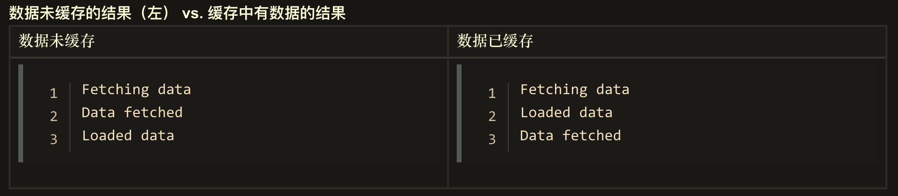

# EventLoop、宏任务、微任务

## Call Stack

 

## EventLoop


```js
console.log(1)

setTimeout(function () {
  console.log(2)
}, 0)

console.log(3)
```


```js
console.log('global begin')  1
setTimeout(function timer1 () {
  queueMicrotask(() => {
    console.log('queueMicrotask') 2
  })
  console.log('timer1 invoke') 3
}, 0)

console.log('global end') 4
```


```js
// 事件循环, 主线程
while (macroQueue.waitForMessage()) {
  // 1. 执行完调用栈上当前的宏任务(同步任务)
  // call stack

  // 2. 遍历微任务队列，把微任务队里上的所有任务都执行完毕(清空微任务队列)
  // 微任务又可以往微任务队列中添加微任务
  for (let i = 0; i < microQueue.length; i++) {
    // 获取并执行下一个微任务(先进先出)
    microQueue[i].processNextMessage()
  }

	// 3. 渲染（渲染线程）
  
  // 4. 从宏任务队列中取 一个 任务，进入下一个消息循环
  macroQueue.processNextMessage();
}
```


https://developer.mozilla.org/zh-CN/docs/Web/API/HTML_DOM_API/Microtask_guide/In_depth

## 产生宏任务的方式

- script 中的代码块
- setTimeout()
- setInterval()
- setImmediate() (非标准，IE 和 Node.js 中支持)
- 注册事件

## 产生微任务的方式

- Promise
- [MutationObserver](https://developer.mozilla.org/zh-CN/docs/Web/API/MutationObserver)
- [queueMicrotask](https://developer.mozilla.org/zh-CN/docs/Web/API/WindowOrWorkerGlobalScope/queueMicrotask)()

```js
queueMicrotask(() => {
  console.log('微任务')
})
```

### [何时使用微任务](https://developer.mozilla.org/zh-CN/docs/Web/API/HTML_DOM_API/Microtask_guide#%E4%BD%95%E6%97%B6%E4%BD%BF%E7%94%A8%E5%BE%AE%E4%BB%BB%E5%8A%A1)

微任务的执行时机，晚于当前本轮事件循环的 Call Stack(调用栈) 中的代码(宏任务)，早于事件处理函数和定时器的回调函数。

使用微任务的最主要原因简单归纳为：

- 减少操作中用户可感知到的延迟
- 确保任务顺序的一致性，即便当结果或数据是同步可用的
- 批量操作的优化

#### 确保任务顺序的一致性

```js
customElement.prototype.getData = url => {
  if (this.cache[url]) {
    this.data = this.cache[url];
    this.dispatchEvent(new Event("load"));
  } else {
    fetch(url).then(result => result.arrayBuffer()).then(data => {
      this.cache[url] = data;
      this.data = data;
      this.dispatchEvent(new Event("load"));
    )};
  }
};

element.addEventListener("load", () => console.log("Loaded data"));
console.log("Fetching data...");
element.getData();
console.log("Data fetched");
```



```js
customElement.prototype.getData = url => {
  if (this.cache[url]) {
    queueMicrotask(() => {
      this.data = this.cache[url];
      this.dispatchEvent(new Event("load"));
    });
  } else {
    fetch(url).then(result => result.arrayBuffer()).then(data => {
      this.cache[url] = data;
      this.data = data;
      this.dispatchEvent(new Event("load"));
    )};
  }
};
```


#### 批量操作

```js
let messageQueue = []
let sendMessage = message => {
  messageQueue.push(message)
  if (messageQueue.length === 1) {
    queueMicrotask(() => {
      const json = JSON.stringify(messageQueue);
      messageQueue.length = 0;
      ajax("url-of-receiver", json);
      console.log(json)
    });
  }
};

queueMicrotask(() => {
  console.log('queueMicrotask')
})

sendMessage('刘备')
sendMessage('关羽')
sendMessage('曹操')
sendMessage('曹操')
sendMessage('曹操')
```


## 参考资料

- [异步 JavaScript](https://developer.mozilla.org/zh-CN/docs/learn/JavaScript/%E5%BC%82%E6%AD%A5)

- [并发模型与事件循环](https://developer.mozilla.org/zh-CN/docs/Web/JavaScript/EventLoop)

- [Microtasks and the JavaScript runtime environment](https://developer.mozilla.org/zh-CN/docs/Web/API/HTML_DOM_API/Microtask_guide/In_depth)
- [在 JavaScript 中通过 queueMicrotask() 使用微任务](https://developer.mozilla.org/zh-CN/docs/Web/API/HTML_DOM_API/Microtask_guide)
- [https://developer.mozilla.org/zh-CN/docs/Web/API/HTML_DOM_API/Microtask_guide/In_depth](https://developer.mozilla.org/zh-CN/docs/Web/API/HTML_DOM_API/Microtask_guide/In_depth)
- [Event loops](https://html.spec.whatwg.org/multipage/webappapis.html#event-loops)

