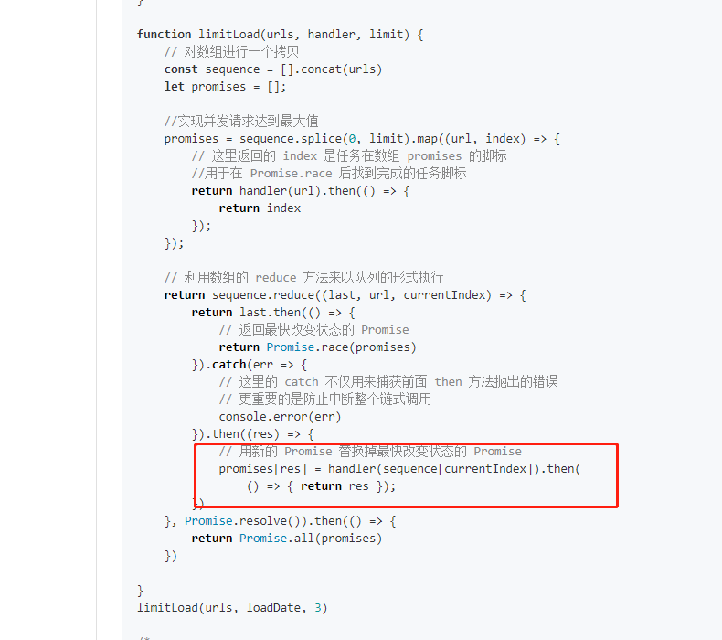

- 记笔记
  - 语雀
  - github
  - 博客
- 看文档
- 制定计划
- 每天进步一点点

# 函数式编程

- 函数式编程是一种编程范式，和面向对象编程是并列关系（编程范式：思想 + 实现的方式）

  - 面向对象编程：对现实世界中的事物的抽象，抽象出对象以及对象和对象之间的关系
  - 函数式编程：把现实世界的事物和事物之间的**联系**抽象到程序世界（对运算过程进行抽象）

  

  重点掌握：

  - 纯函数

    [https://zh.wikipedia.org/wiki/%E7%BA%AF%E5%87%BD%E6%95%B0](https://zh.wikipedia.org/wiki/纯函数)

    在程序设计中，若一个函数符合以下要求，则它可能被认为是**纯函数**：

    * 此函数在**相同的输入**值时，需**产生相同的输出**。函数的输出和输入值以外的其他隐藏信息或[状态](https://zh.wikipedia.org/w/index.php?title=程式狀態&action=edit&redlink=1)无关，也和由I/O设备产生的外部输出无关。
  * 该函数**不能有**语义上可观察的函数**副作用**，诸如“触发事件”，使输出设备输出，或更改输出值以外物件的内容等。(如果参数是引用传递，对参数的更改会影响函数以外的数据，因此不是纯函数)
  
  - 柯里化

  - 函数组合  lodash/fp   compose(fn, n1)  ---> flowRight

  ```js
const fp = require('lodash/fp')
  
  const add = (a, b) => {
    return a + b
  }
  
  const f = fp.compose(fp.curry(add)(5), add)
  console.log(f(1, 2))
  ```
  
  - 函子暂时可以作为了解  Array.of()    arr.map()

- 柯里化概念意义和用法

  - 柯里化：把多个参数的函数转换可以具有任意个参数的函数，可以给函数组合提供细粒度的函数

  - 应用：

    - Vue.js 源码中使用柯里化的位置

      - src/platform/web/patch.js

      ```js
      // patch(obj, vdom1, vdom2)
      
      function createPatch (obj) {
        let ...
        return function patch (vdom1, vdom2) {
          ..
        }
      }
      
      const patch = createPatch(...)
      patch(vdom1, vdom2)
      ```

- 固定不常变化的参数

  

  ```js
  // 方法1
  function isType (type) {
    return function (obj) {
      return Object.prototype.toString.call(obj) === `[object ${type}]`
    }
  }
  
  const isObject = isType('Object')
  const isArray = isType('Array')
  
  
  // 方法2
  function isType (type, obj) {
    return Object.prototype.toString.call(obj) === `[object ${type}]`
  }
  
  let isTypeCurried = curry(isType)
  
  const isObject = isTypeCurried('Object')
  // isObject(obj)
  
  // 柯里化通用函数
  function curry (func) {
    return function curriedFn (...args) {
      // 判断实参和形参的个数
      if (args.length < func.length) {
        return function () {
          return curriedFn(...args.concat(Array.from(arguments)))
        }
      }
      // 实参和形参个数相同，调用 func，返回结果
      return func(...args)
    }
  }
  
  function getSum (a, b, c) {
  	return a + b + c
  }
let curried = curry(getSum)
  curried(1, 2, 3)
  curried(1)(2)(3)
  curried(1, 2)(3)
  ```
  
  - 延迟执行(模拟 bind 方法)
  
  ```js
  function fn (a, b, c) {
  }
  const f = fn.bind(context, 1, 2)
  f(3)
  
  const f = fn.bind(context, 1)
  f(2, 3)
  
  const f = fn.bind(context)
  f(1,2,3)
  
  // rest 参数
  Function.prototype.mybind = function (context, ...args) {
    return (...rest) => this.call(context, ...args, ...rest)
  }
  
  function t (a, b, c) {
    return a + b + c
  }
  
  t.mybind()
  
  const sumFn = t.mybind(this, 1, 2)
  const sum = sumFn(3)
  console.log(sum)
  ```


- 函子在开发中的实际使用场景
  - 作用是控制副作用 (IO)、异常处理 (Either)、异步任务 (Task)

```js
class Functor {
  static of (value) {
    return new Functor(value)
  }
  
  constructor (value) {
    this._value = value
  }

  map (f) {
    return new Functor(f(this._value))
  }

  value (f) {
    return f(this._value)
  }
}

const toRMB = money => new Functor(money)
  .map(v => v.replace('$', ''))
  .map(parseFloat)
  .map(v => v * 7)
  .map(v => v.toFixed(2))
  .value(v => '¥' + v)

console.log(toRMB('$299.9'))
```

- folktale
  - https://folktale.origamitower.com/

```js
const MayBe = require('folktale/maybe')

const toRMB = m => MayBe.fromNullable(m)
  .map(v => v.replace('$', ''))
  .map(parseFloat)
  .map(v => v * 7)
  .map(v => v.toFixed(2))
  .map(v => '¥' + v)
	// .unsafeGet()
  .getOrElse('noting')

console.log(toRMB(null))
```


# 函数的执行上下文和闭包

## 函数的执行上下文

- 执行上下文（Execution Context）

  - 全局执行上下文
  - 函数级执行上下文
  - eval 执行上下文

- 函数执行的阶段可以分文两个：函数建立阶段、函数执行阶段

  - 函数建立阶段：当调用函数时，还没有执行函数内部的代码

    - 创建执行上下文对象

      ```js
      fn.ExecutionContext = {
        variableObject:  // 函数中的 arguments、参数、局部成员
        scopeChains:  // 当前函数所在的父级作用域中的活动对象
        this: {}			// 当前函数内部的 this 指向
      }
      ```

    function fn() {}

    - this 指向复习
      - fn() 直接调用，如果是非严格模式  this 指向 window，如果是严格模式this指向 undefined
      - obj.fn()  如果是函数调用，谁调用this指向谁
      - 构造函数中的 this ，指向的是当前创建的对象
      - 箭头函数中的this 指向父级作用域 中的this
      - 改变this的情况。。bind  call  apply

  - 函数执行阶段

    ```js
    // 把变量对象转换为活动对象
    fn.ExecutionContext = {
      activationObject:  // 函数中的 arguments、参数、局部成员
      scopeChains:  // 当前函数所在的父级作用域中的活动对象
      this: {}			// 当前函数内部的 this 指向
    }
    ```

- [[Scopes]] 作用域链，函数在创建时就会生成该属性，js 引擎才可以访问。这个属性中存储的是所有父级中的活动对象

```js
function fn (a, b) {
  function inner () {
    console.log(a, b)
  }
  console.dir(inner)
  // return inner
}
console.dir(fn)
const f = fn(1, 2)
```


## [闭包](https://developer.mozilla.org/zh-CN/docs/Web/JavaScript/Closures)

- https://developer.mozilla.org/zh-CN/docs/Web/JavaScript/Closures

- 发生闭包的两个必要条件

  1. 外部对一个函数 makeFn 内部有引用
  2. 在另一个作用域能够访问到 makeFn 作用域内部的局部成员

  > 使用闭包可以突破变量作用域的限制，原来只能从一个作用域访问外部作用域的成员
  >
  > 有了闭包之后，可以在外部作用域访问一个内部作用域的成员
  >
  > 可以缓存参数
  >
  > 根据不同参数生成不同功能的函数
  >
  > 

```js
function makeFn () {
  let name = 'MDN'
  return function inner () {
    console.log(name)
  }
}

let fn = makeFn()
fn()

fn = null

```

- 缓存参数

```js
function createPatch (obj) {
  return function patch (vdom1, vdom2) {
    ..
  }
}

const patch = createPatch(...)
              
                          
function makeAdder(x) {
  return function(y) {
    return x + y;
  };
}

var add5 = makeAdder(5);
var add10 = makeAdder(10);

console.log(add5(2));  // 7
console.log(add10(2)); // 12
```

# 反馈问题

## 函数式编程  

- 为什么要以loadsh函数库为例进行讲解？是否有其他类似的函数库？

  - underscore 不推荐
  - ramda
  - folktale

- 如何模拟 reduce 原理以及他的用法？各种函子讲解的不是太详细，很难看明白，自己查阅了一些资料，也很难看明白

  - https://developer.mozilla.org/zh-CN/docs/Web/JavaScript/Reference/Global_Objects/Array/Reduce

- 函数组合为什么默认习惯是从右到左，loadash中命名flow 和 flowRight 应该表示默认习惯是从左到右吧？

  - compose(f, g)
  - f(g(x))
  - webpack 中 loader 的执行顺序也是从右到左

- 组合函数参数交换 不理解，希望详细点讲

  const split = *.curry((sep, str) =>* .split(str, sep))

  const join = *.curry((sep, array) =>* .join(array, sep)) 

  const map = *.curry((fn, array) =>* .map(array, fn))

  ```js
  const _ = require('lodash')
  
  // 非柯里化 数据优先 迭代置后
  // _.split(str, sep)
  // _.join(array, sep)
  // _.map(array, fn)
  
  // const f = _.flowRight(_.join(...), _.map(...), _.split)
  // console.log(f('NEVER SAY DIE', ' '))
  
  const split = _.curry((sep, str) => _.split(str, sep))
  const join = _.curry((sep, array) => _.join(array, sep))
  const map = _.curry((fn, array) => _.map(array, fn))
  const f = _.flowRight(join('-'), map(_.toLower), split(' '))
  console.log(f('NEVER SAY DIE'))
  ```

  ```js
  const fp = require('lodash/fp')
  
  // 自动柯里化 数据置后 迭代优先
  fp.split(sep)(str)
  fp.join(sep, array)
  fp.map(fn, array)
  
  const f = fp.compose(fp.join('-'), fp.map(fp.toLower), fp.split(' '))
  ```

  

- 柯里化实现原理不是很懂 

  ```js
  function curry (func) {
    return function curriedFn (...args) {
      // 判断实参和形参的个数
      if (args.length < func.length) {
        return function () {
          return curriedFn(...args.concat(Array.from(arguments)))
        }
      }
      // 实参和形参个数相同，调用 func，返回结果
      return func(...args)
    }
  }
  
  function getSum (a, b, c) {
    return a + b + c
  }
  let curried = curry(getSum)
  curried(1, 2, 3)
  curried(1)(2)(3)
  curried(1, 2)(3)
  ```

  

- 案例疑问：有一个取数组最后一个元素再首字母大写的例子，我觉得调用reverse改变了传入的数组，举这种例子来讲函数式变成感觉不太合适。

  ```js
  const _ = require('lodash')
  
  const toUpper = s => s.toUpperCase()
  const reverse = arr => arr.reverse()
  const first = arr => arr[0]
  
  const f = _.flowRight(toUpper, first, reverse)
  console.log(f(['one', 'two', 'three']))
  ```

  ```js
  const fp = require('lodash/fp')
  const f = fp.compose(fp.toUpper, fp.first, fp.reverse)
  console.log(f(['one', 'two', 'three']))
  ```

  

- 函子使用场景，对于函子等概念如何在项目中落地不清楚

    对函子理解的不是跟透彻，函数式编程会在什么情况下用到

    想知道更多关于函子的实战用法，不一定是函子，函数式编程的实战用法

    希望多讲解些，这些技术在实际使用中会有哪些坑

    函子那部分里task的异步太绕了，直接没看懂，还有就是不知道函子的具体使用环境，就是什么情 况下需要使用函子

    对函子的内容不太理解，不知道是做什么的，它的应用场景等

  函子、组合函数、柯里化在实际项目业务中怎么运用

  Task函子和Monad函子的执行机制，此类函子模式的方法使用场景

  MayBe函子，Either函子，IO函子，Task函子，Pointed函子，工作中有什么用？暂时工作中没有涉及到

- 函子这块的内容，个人觉得先抛出个问题比较好，比如xxx的原理是由多个函子组成，是哪些函子组成，然后引申出具体的函子，每个函子的作用。这样感觉记忆会更深刻一点，就像看书一样，得带着问题看书，边看边思考。

## 异步编程

- 宏任务与微任务讲不够透彻；多讲一些异步编程在**工作中常踩的坑**，比如setTimeout, async await经常用错的地方

  - https://mp.weixin.qq.com/s/47DcTGS9KUiiiO3KEMvrYw

- Generator 生成器 和 Async/await，讲的太快，有点没听懂

  生成器函数 再详细点讲

- promise的原理，promise如果一直挂起状态会怎么样？一些promise的应用场景

  - 原理: 参考视频中的 promise 实现
  - 通过 then 方法注册的回调函数是异步执行的, 如果状态一直挂起并不会影响主程序的正常执行.
  - 通过异步实现的功能都可以考虑 promise, 比如异步的回调函数地狱问题就可以通过promise解决, 再比如类库的封装, 内部返回 promise 外部就可以使用异步函数, 代码会更加简洁易懂可维护.

- 讲到了promise可以对现在的fetch和axios讲下

  ```
  1. 基础语法
  
        axios:
  
           const options = {
              url: 'http://localhost/test.htm',
              method: 'POST',
              headers: {
                 'Accept': 'application/json',
                 'Content-Type': 'application/json;charset=UTF-8'
              },
              data: {
                 a: 10,
                 b: 20
              }
           };
  
           axios(options)
           .then(response => {
              console.log(response.status);
           });
  
        fetch:
  
           const url = 'http://localhost/test.htm';
           const options = {
              method: 'POST',
              headers: {
                 'Accept': 'application/json',
                 'Content-Type': 'application/json;charset=UTF-8'
              },
              body: JSON.stringify({
                 a: 10,
                 b: 20
              })
           };
  
           fetch(url, options)
              .then(response => {
                 console.log(response.status);
              });
        
        1. 要发送数据, fetch() 使用 body 属性, 而 axios 使用 data 属性
        2. fetch 中的数据需要被手动 stringify
        3. fetch 中 url 是被作为参数传递的, axios 中 url 是被设置在 options 对象中的
     
     2. 向下兼容
  
        axios 的主要卖点之一就是其广泛的浏览器支持, 而 fetch 不具备这个特性.
        但如果你使用 axios 的唯一理由是浏览器的兼容那么实际上你不需要 axios. 这个问题完全可以通过 polyfill 解决. 比如 whatwg-fetch
  
     3. 设置超时
  
        在 axios 中设置超时非常简单, 通过 timeout 属性即可.
  
           axios({
              timeout: 4000
           })
        
        在 fetch 中设置超时需要通过 AbortController
  
           const controller = new AbortController();
           const options = {
              signal: controller.signal
           };  
           const promise = fetch('/login', options);
           const timeoutId = setTimeout(() => controller.abort(), 4000);
  
           promise
              .then(response => {/* handle the response */})
              .catch(error => console.error('timeout exceeded'));
        
     
     4. HTTP拦截器
  
        axios 具有拦截器功能, 但是 fetch 中没有. 
        但是在 fetch 中也不难解决, 可以通过覆盖原有 fetch 解决.
  
           fetch = (originalFetch => {
              return (...arguments) => {
                 const result = originalFetch.apply(this, arguments);
                    return result.then(console.log('Request was sent'));
              };
           })(fetch);
  
           fetch('https://api.github.com/orgs/axios')
              .then(response => response.json())
              .then(data => {
                 console.log(data) 
              });
  
  ```

- 

- 手写promise的时候，实例属性写在constructor外，需要node12+ ，写在里面低版本也可以，是12+ 的版本对类新加了这方面的支持吗

  - https://es6.ruanyifeng.com/#docs/class#%E5%AE%9E%E4%BE%8B%E5%B1%9E%E6%80%A7%E7%9A%84%E6%96%B0%E5%86%99%E6%B3%95
  - https://developer.mozilla.org/zh-CN/docs/Web/JavaScript/Reference/Classes

- promise 中的 then里面的return 值和resolve的区别（记得，视频里面好像提到过一嘴，具体的记不太清，感觉有点混乱）

  - then 中的返回值会传递给下一个 then 中注册的回调函数.
  - resolve 方法在调用后参数会传递给第一个 then 中注册的回调函数.

- 这个的实现方式感觉有些不太明白，希望可以讲解一下

  - 案例中的 promise 数组中的值需要出一个, 进一个, 进入的要替换出去的. 始终保持 promise 数组中元素的数量. handler 方法中传递的是 url, 返回的是要执行的 promise. 就是要进入 promise 数组中的 promise 对象
  - https://developer.mozilla.org/zh-CN/docs/Web/JavaScript/Reference/Global_Objects/Array/Reduce#%E6%8C%89%E9%A1%BA%E5%BA%8F%E8%BF%90%E8%A1%8CPromise

*|*

## 其他问题

- 什么时候使用闭包？闭包讲得太少了，扩展一下闭包的性能问题及优化方案
- class详细用法，书写规则

- node环境 var 声明变量的作用域范围

- 对1026的面试题解法不太理解，希望老师可以讲解一下